# XBRL Document Conversion - Architecture Documentation

This document provides a comprehensive overview of the XBRL Document Conversion system architecture, including component diagrams, data flows, and interaction patterns.

## Table of Contents
1. [System Overview](#system-overview)
2. [High-Level Architecture](#high-level-architecture)
3. [Component Architecture](#component-architecture)
4. [Conversion Flow](#conversion-flow)
5. [Web UI Flow](#web-ui-flow)
6. [MCP Server Architecture](#mcp-server-architecture)
7. [Data Models](#data-models)

---

## System Overview

The XBRL Document Conversion system is built on top of the Docling library and provides multiple interfaces for converting XBRL (eXtensible Business Reporting Language) documents into various formats (Markdown, JSON, HTML).

### Key Features
- XBRL instance document parsing
- Taxonomy validation (local and remote)
- Multiple export formats
- Web UI for easy interaction
- MCP server for programmatic access
- Offline processing support

---

## High-Level Architecture

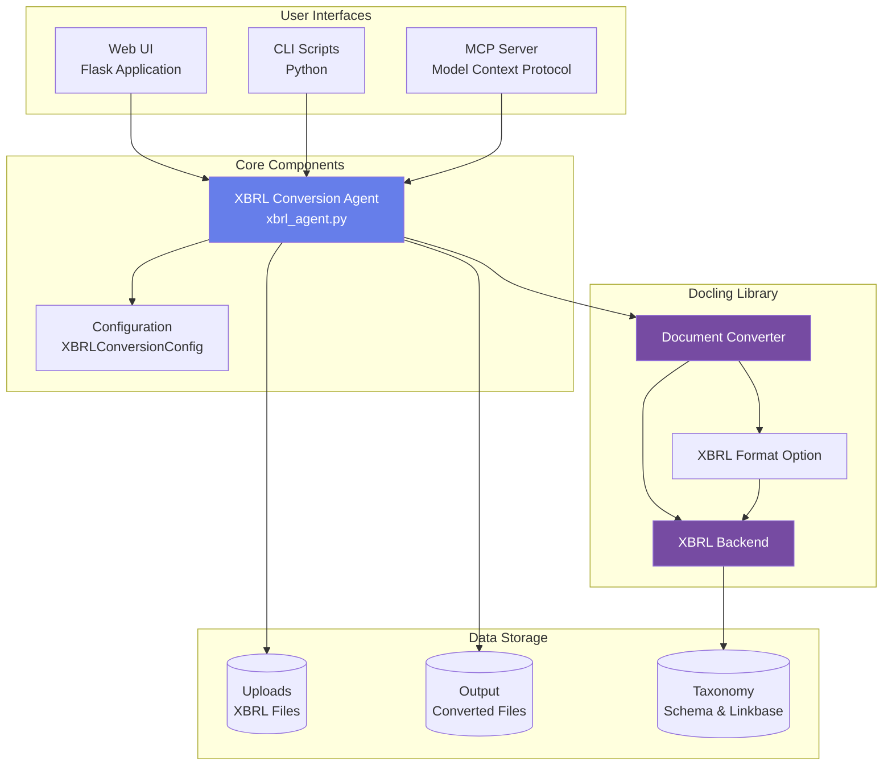

---

## Component Architecture

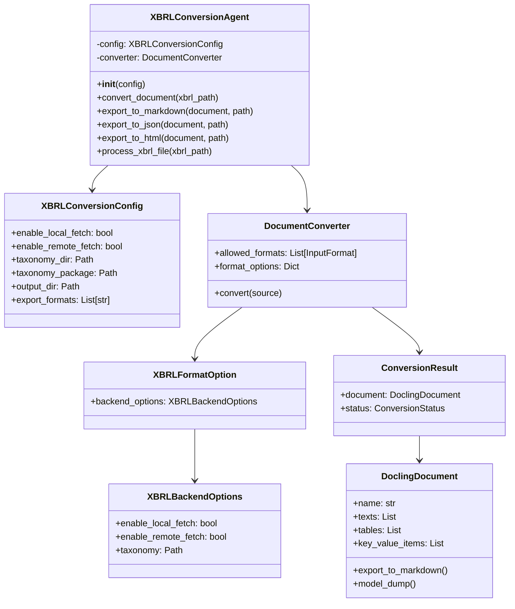

---

## Conversion Flow

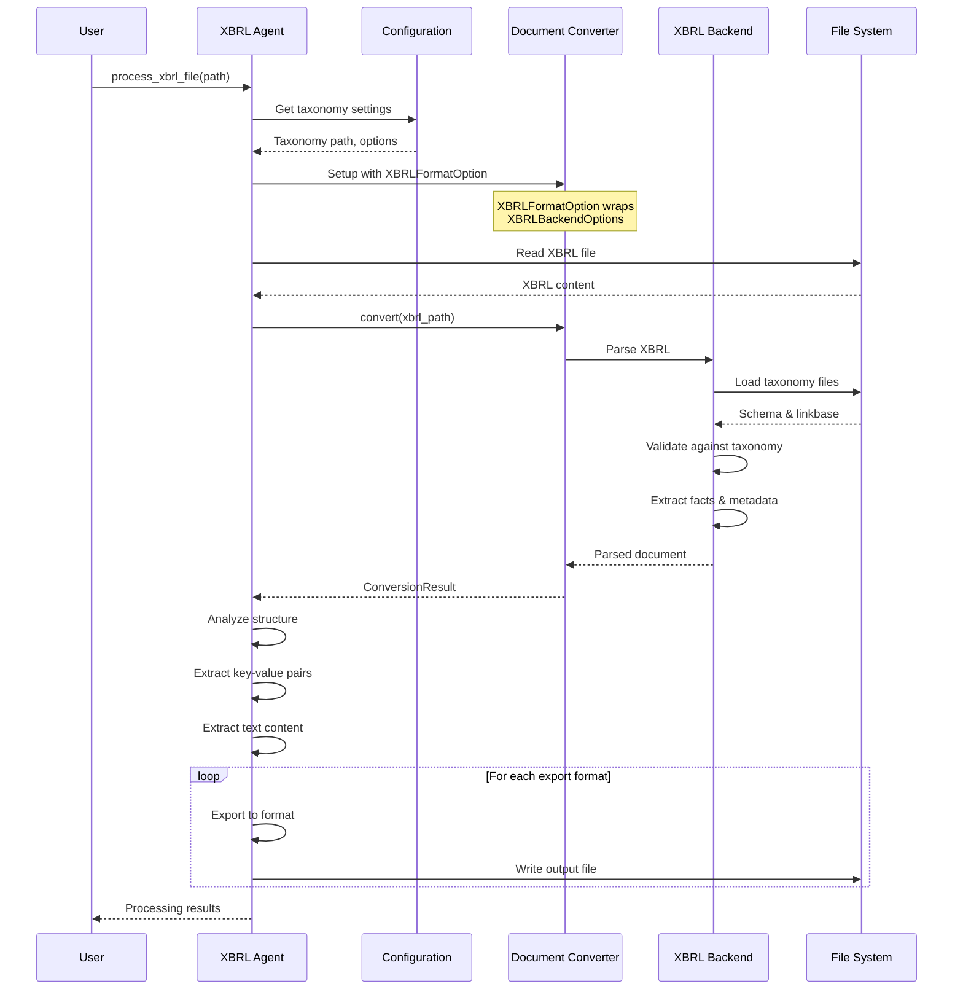

---

## Web UI Flow

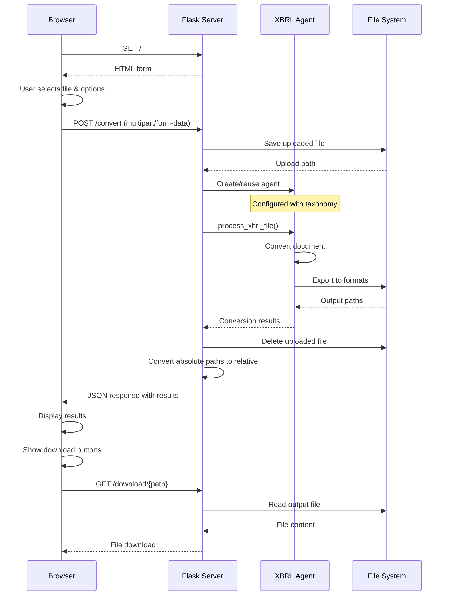

### Web UI Component Interaction

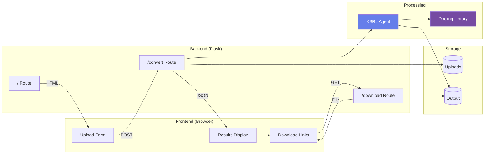

---

## MCP Server Architecture

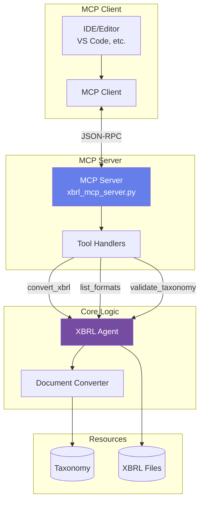

### MCP Tool Flow

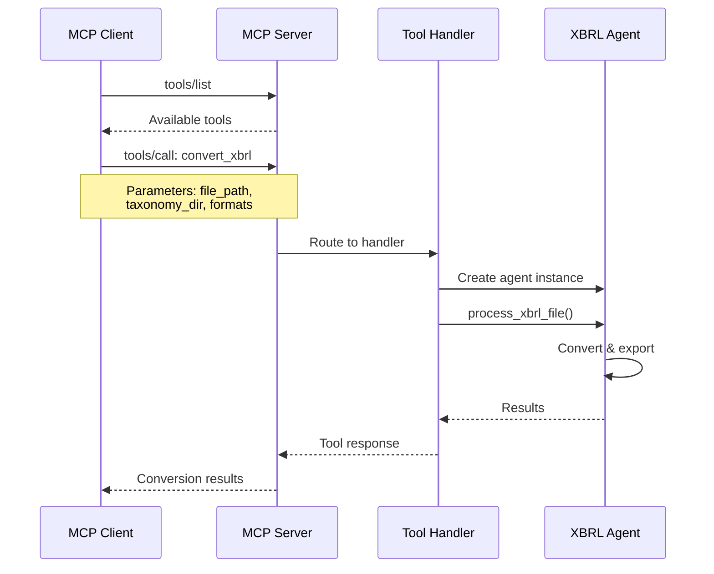

---

## Data Models

### XBRL Document Structure

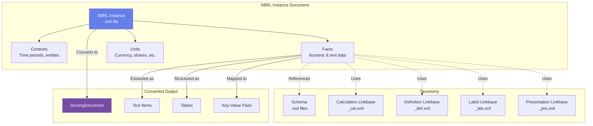

### Configuration Flow

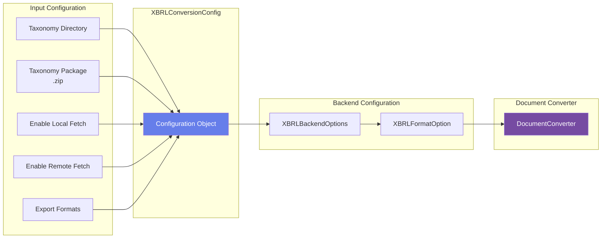

---

## File Organization

```
docling-xbrl-test/
├── xbrl_agent.py              # Core conversion agent
├── xbrl_mcp_server.py         # MCP server implementation
├── requirements.txt           # Python dependencies
├── examples/
│   ├── web_ui.py             # Flask web interface
│   └── basic_usage.py        # CLI examples
├── scripts/
│   ├── start.sh              # Start services
│   └── stop.sh               # Stop services
├── uploads/                   # Uploaded XBRL files
├── output/                    # Converted output files
├── Docs/
│   ├── ARCHITECTURE.md       # This document
│   ├── API_REFERENCE.md      # API documentation
│   ├── SETUP_GUIDE.md        # Setup instructions
│   └── MCP_SERVER.md         # MCP server guide
└── _data/
    └── xbrl/
        └── mlac-taxonomy/    # Taxonomy files
```

---

## Technology Stack

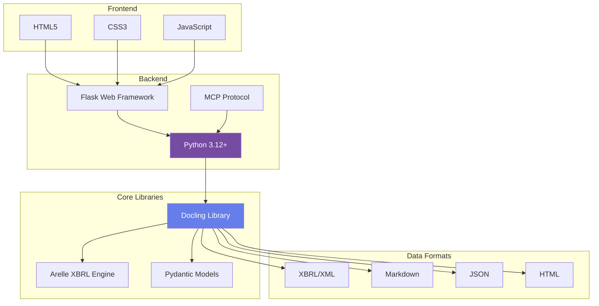

---

## Deployment Architecture

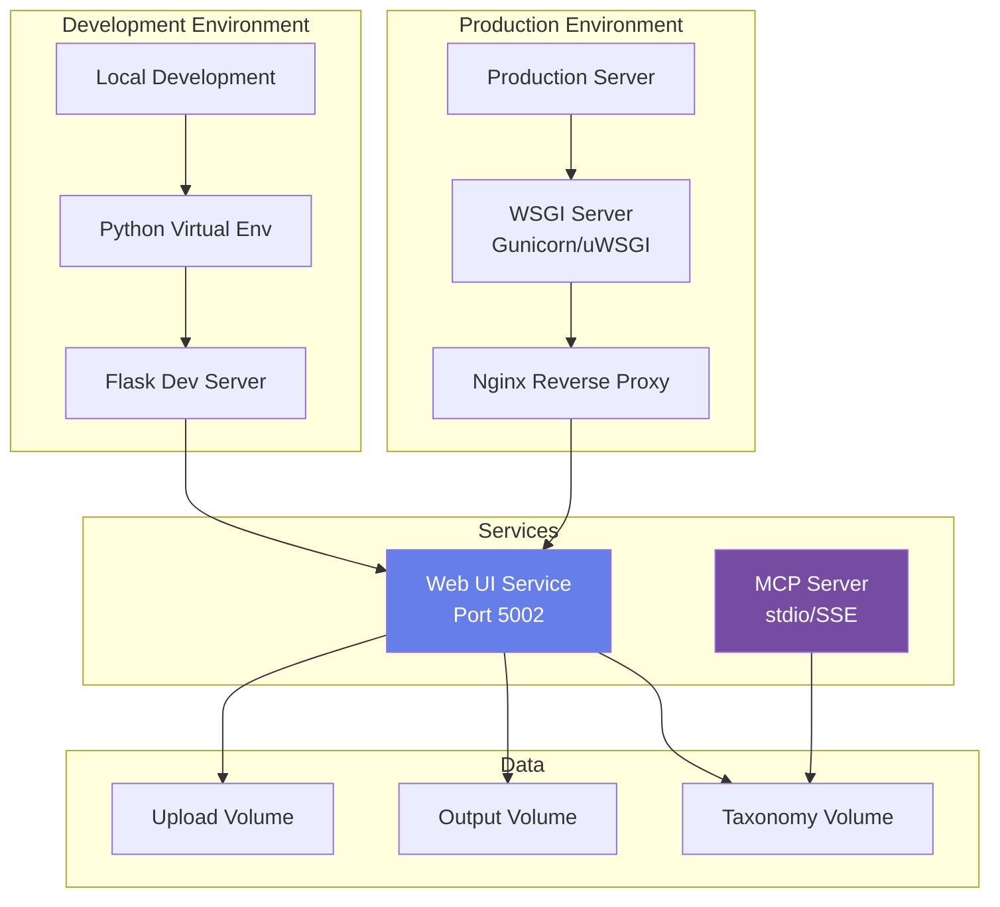

---

## Error Handling Flow

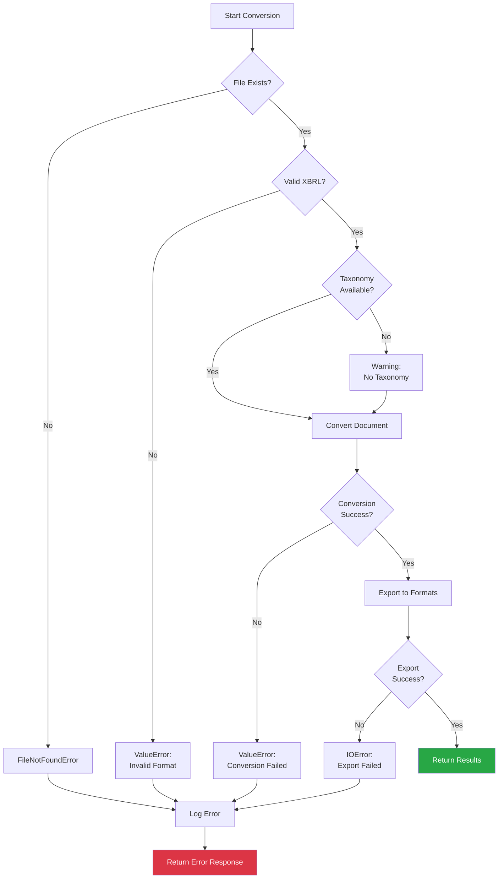

---

## Performance Considerations

### Caching Strategy

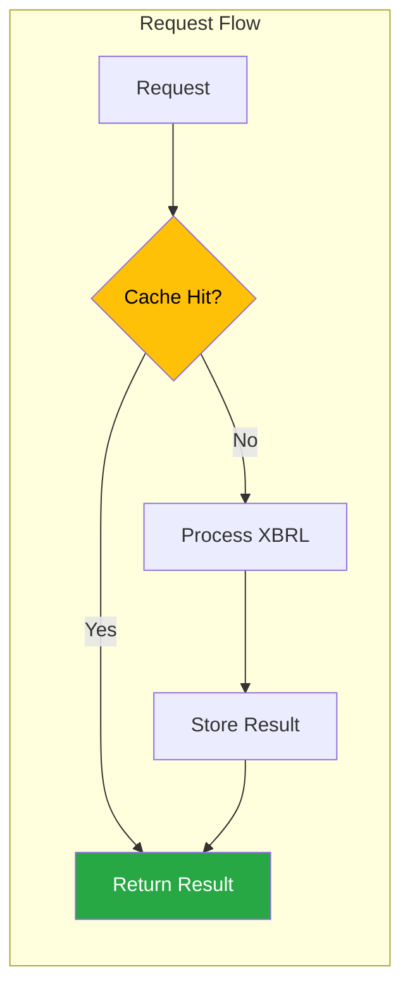

### Optimization Points

1. **Taxonomy Caching**: Load taxonomy once, reuse for multiple conversions
2. **Agent Reuse**: Keep agent instance alive in web UI
3. **Streaming**: Process large files in chunks
4. **Parallel Processing**: Convert to multiple formats concurrently
5. **File Cleanup**: Remove temporary files after processing

---

## Security Considerations

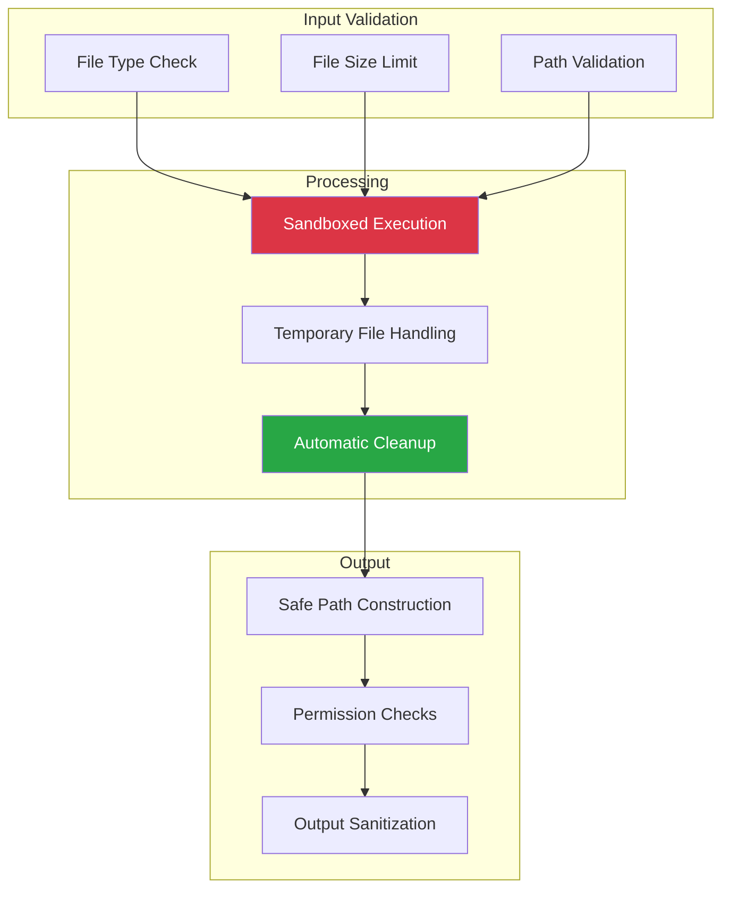

---

## Future Enhancements

1. **Batch Processing**: Convert multiple XBRL files in parallel
2. **API Authentication**: Add OAuth2/JWT authentication for MCP server
3. **Cloud Storage**: Support S3/Azure Blob for taxonomy and outputs
4. **Real-time Updates**: WebSocket support for conversion progress
5. **Advanced Analytics**: Extract financial ratios and trends
6. **Visualization**: Generate charts from financial data
7. **Comparison Tools**: Compare multiple XBRL filings
8. **Validation Reports**: Detailed taxonomy validation results

---

## Conclusion

This architecture provides a flexible, extensible system for XBRL document conversion with multiple interfaces (Web UI, CLI, MCP) and robust error handling. The modular design allows for easy maintenance and future enhancements.

For more details, see:
- [API Reference](API_REFERENCE.md)
- [Setup Guide](SETUP_GUIDE.md)
- [MCP Server Documentation](MCP_SERVER.md)